<!-- ────────────────────────────────────────────────────────────────
     anuj1o0 · profile readme
     assets/ are hand-authored SVGs. edit colours there, not here.
     palette  ground #0B1220 · road #253449 · signal #5BE0C8 · flag #FFA94D
     replace {{PLACEHOLDERS}} before pushing.
     ──────────────────────────────────────────────────────────────── -->



<p align="center">
  <a href="{{[LINKEDIN_URL](https://www.linkedin.com/in/anuj-srivastava090/)}}"></a>
  <a href="{{[LEETCODE_URL](https://leetcode.com/Anuj_098/)}}"></a>
  <a href="{{[PORTFOLIO_URL](https://portfolio-anuj-seven.vercel.app/)}}"></a>
  <a href="mailto:anujsrivastava176@gmail.com"></a>
  <a href="https://banlxlai.in"></a>
</p>



<br>

## ▸ whoami

Final-year CS (AI/ML) at **Bennett University**, currently building pipeline automation for **ADAS map production** at HERE Technologies — the maps that tell a car what the speed limit is before it gets there.

On the side I run **BankXL**, a live SaaS that turns bank statement PDFs into clean structured data. Real billing, real customers, real edge cases across 20+ Indian bank formats.

I like problems where the messy part *is* the problem.


## ▸ route log

```
2026  ●  b.tech cse (ai/ml) — bennett university · cgpa 9.15
      │
2025  ●  here technologies — sde intern
      │  adas map automation across bmw, continental, subaru, gm-isa
      │  gitlab ci/cd · splunk · aws s3 · confluence api
      │
2025  ●  bankxl ships — first paying customers
      │  claude vision vs gemini benchmark → hybrid parsing pipeline
      │
2024  ●  amazon ml summer school — top 3,000 nationally
      │
2024  ●  google ai campus fest · legalease — top 10 teams nationally
      │  smart india hackathon — 1st, university showcase
      │  hackcbs — top 15 of 10,000+
      │
2022  ●  started at bennett
```


## ▸ shipped

<table>
<tr>
<td width="50%" valign="top">

**BankXL** &nbsp;·&nbsp; `live` &nbsp;·&nbsp; [bankxlai.in](https://banlxlai.in)

Bank statement PDFs → Excel, CSV, JSON. Tiered billing, Supabase auth, paying users.

I benchmarked Claude Vision against Gemini for extraction, then iterated on prompts, structured-output schemas and failure handling until a hybrid pipeline beat either model alone across 20+ Indian bank formats.

`Next.js 14` &nbsp;`TypeScript` &nbsp;`Supabase` &nbsp;`Razorpay`

</td>
<td width="50%" valign="top">

**StockSwabhava** &nbsp;·&nbsp; [`repo`]({{STOCKSWABHAVA_REPO_URL}})

A paper-trading platform with a properly transactional order engine.

Weighted-average buy pricing, virtual cash management, bcrypt auth, schema built for horizontal scale. Unit and integration tests cover every critical path — buy, sell, portfolio — including concurrent-user edge cases.

`React` &nbsp;`FastAPI` &nbsp;`PostgreSQL` &nbsp;`SQLAlchemy`

</td>
</tr>
</table>

<details>
<summary>&nbsp;<b>▸ what the HERE work actually involves</b></summary>

<br>

**Pipeline automation framework** — end-to-end, across 6+ automotive programs. GitLab CI/CD, Splunk, AWS S3 and Confluence APIs stitched into one flow. Manual end-of-day reporting went from a daily chore to nothing at all: 90+ hours back every month.

**Attribute deviation analysis on S3** — flags threshold breaches across 4 classification dimensions and emits stakeholder-ready Excel reports, so quality gets caught *before* a customer map release rather than after.

**30+ root cause analyses** across Tier-1 OEM releases, separating source data defects from software defects across EU and NA regions.

**ISA speed-limit specifications** — regulatory exception rules for Spain, Portugal, Turkey and the UK with vehicle-type fallback logic, which unblocked Continental's ADAS production readiness.

</details>


## ▸ toolchain

<table>
<tr><td><sub><b>LANGUAGES</b></sub></td><td>


</td></tr>

<tr><td><sub><b>BACKEND</b></sub></td><td>


</td></tr>

<tr><td><sub><b>FRONTEND</b></sub></td><td>


</td></tr>

<tr><td><sub><b>AI / ML</b></sub></td><td>


</td></tr>

<tr><td><sub><b>INFRA</b></sub></td><td>


</td></tr>

<tr><td><sub><b>AI-FIRST</b></sub></td><td>


</td></tr>
</table>


## ▸ telemetry

<p align="center">


</p>

<p align="center">

</p>

<p align="center">

&nbsp;

</p>

<p align="center">
<picture>
  <source media="(prefers-color-scheme: dark)" srcset="https://raw.githubusercontent.com/anuj1o0/anuj1o0/output/snake-dark.svg">
  
</picture>
</p>


## ▸ signal

Open to SDE and AI engineering roles, and to anyone with a genuinely hard problem.

<a href="mailto:anujsrivastava176@gmail.com"></a>
<a href="{{LINKEDIN_URL}}"></a>
<a href="https://bankxlai.in"></a>

<br>

<sub>`19.0760° N, 72.8777° E` — Mumbai, IN &nbsp;·&nbsp; </sub>
